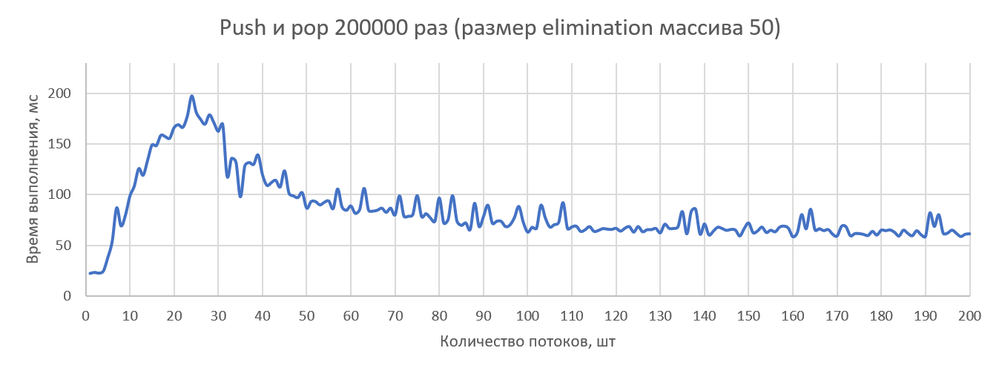
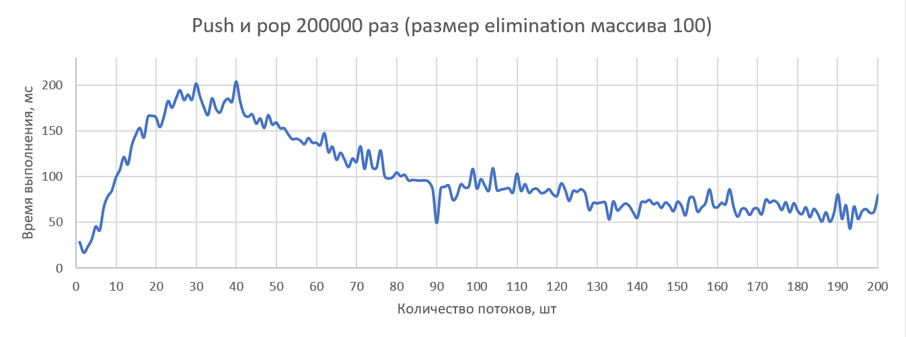
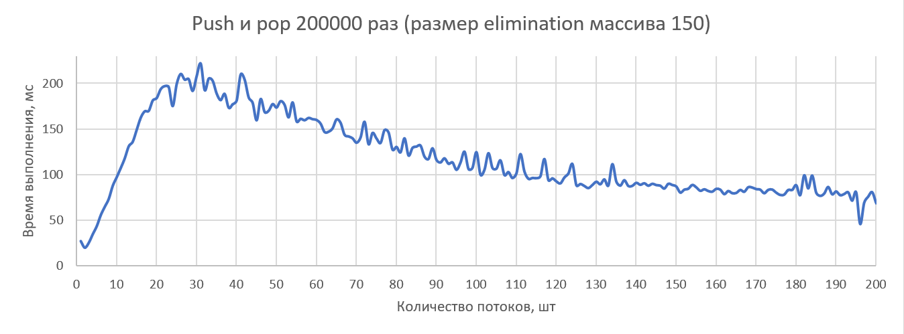
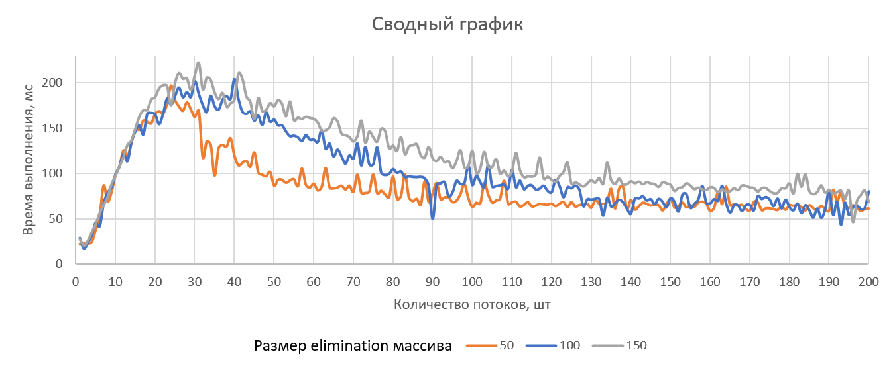

## Лабораторная работа 2. Линейные разделяемые структуры данных

---

1. Реализовать структуру данных (языки: C++/C желательно, Java допускается, но хуже)
2. Разработать простой тест
3. Оценить эффективность, построить графы, проанализировать, сформулировать выводы.
4. Написать отчет с результатами экспериментов и выводами.

---

Задание - стек на основе устранения парных операций (elimintation-backoff stack).

Пример запуска:

```
Testing 1 threads
Testing done
Testing 2 threads
Testing done

Process finished with exit code 0
```

Пример файла `output.txt` с результатами работы:
```
threads,time
1,2.1
2,2.2
```

#### Бенчмарк

Общее число операций push и pop - 200000, распределение 50 на 50. Каждый поток получает `1/N` от общего числа операций, где `N` - число потоков.

Число потоков - 1..200. Для каждого числа потоков происходит 10 запусков, итоговое время - среднее по 10.

Размер elimination массива - 50, 100, 150.

Тестовая машина: Intel Core i5-7200U, 2 ядра, 4 потока, RAM 8 GB.

Результат:









См. `EBStack.xls` с оригинальными данными.

#### Выводы

Elimination-backoff stack является модификацией алгоритма lock-free для стека, опубликованного Treiber. В lock-free стеке, фактически, происходит повторение атомарной операции compare-and-swap (CAS) по отношению к вершине стека до получения желаемого результата. При неуспешном CAS, когда между прочтением значения вершины стека и применением CAS другой поток успел изменить значение вершины, происходит отступление (back off) и поток ожидает либо делает что-то другое. Как и насколько отступать называется back off стратегией, они помогают решить проблему неудачного CAS, но почти не способствуют выполнению операций со стеком.

В elimination-backoff стеке используется elimination-backoff стратегия. Основное наблюдение – операции push и pop являются взаимодополняющими, т.е. если один поток выполнил push, а другой pop, то получение значения вершины стека можно исключить, а данные push-потока передать pop-потоку. Обмен информацией о действиях потоков производится с помощью elimination массива. Если поток обнаруживает, что другой поток выполняет взаимодополняющую операцию, то они обмениваются данными. Иначе поток продолжает ожидать и пытаться выполнить желаемую операцию. Такая стратегия должна разгрузить стек при большом количестве операций pop и push.

Алгоритм можно настраивать, изменяя размер elimination массива. По результатам тестов видно, что для всех трех размеров массива рост времени работы при увеличении числа потоков происходит схожим образом до примерно 25 потоков. При использовании массива размерностью 50 происходит резкое уменьшение времени, при двух других размерностях время также начинает убывать после 30 потоков, но не так резко. После 140 потоков время перестает значительно изменяться, при этом размерности 50 и 100 дают близкие результаты. Размерность 150 оказалась худшим вариантом. На данном тестовом ПК при данном количестве и соотношении операций push и pop лучший результат показал размер elimination массива 50 при числе потоков более 30. Возможно улучшение результатов при использовании адаптивного варианта алгоритма, в котором размер массива изменяется в процессе работы в зависимости от нагрузки на стек.